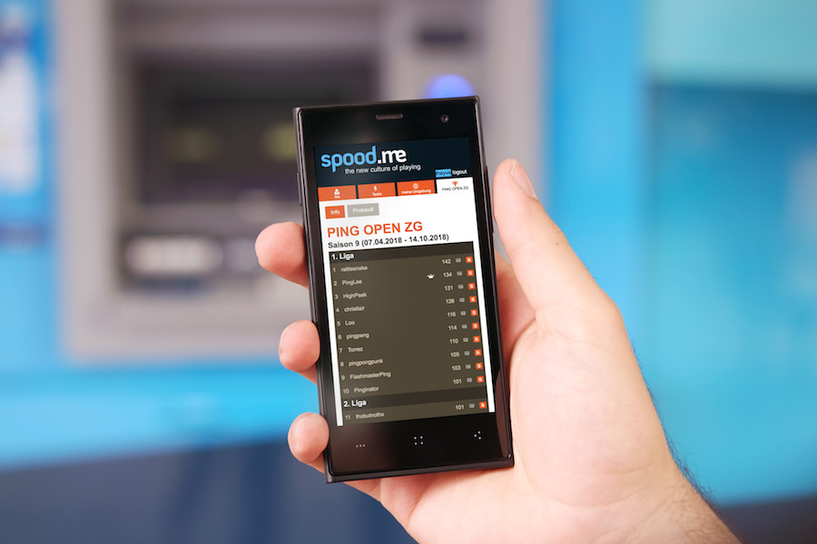
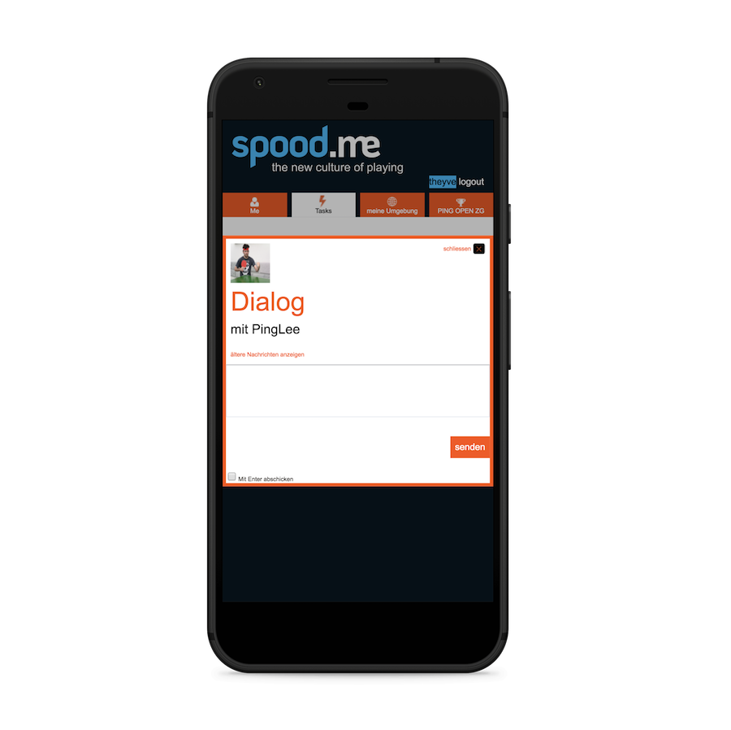
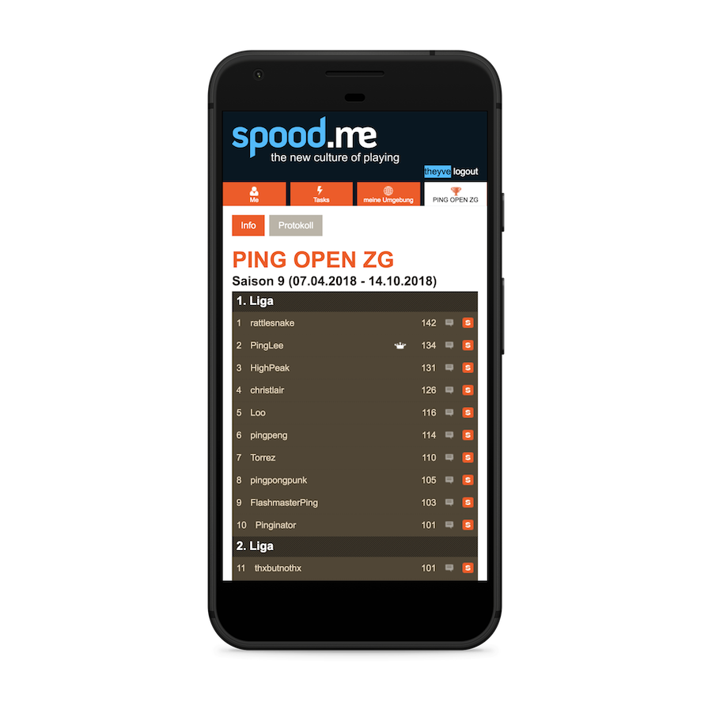
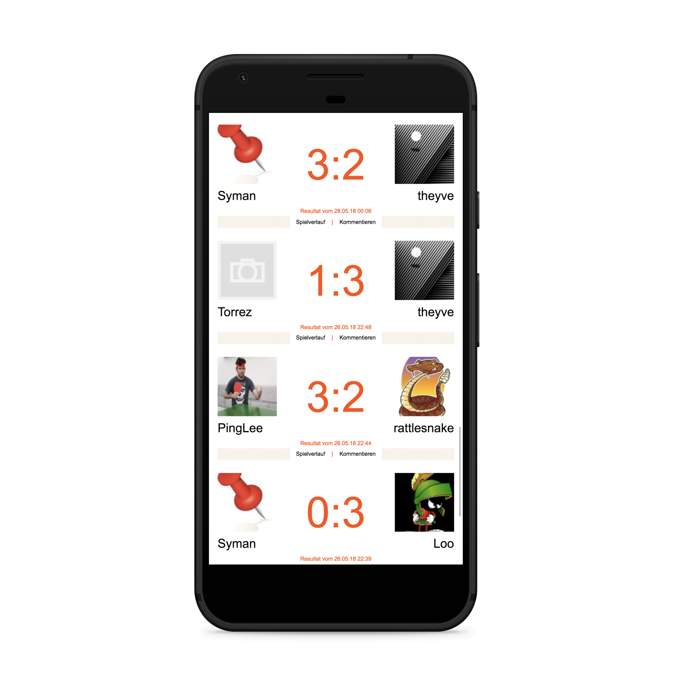

### ⚠️ Die Website spood.me wurde 2019 eingestellt. Dieses Repo hat keine Verwendung mehr. ⚠️

-----

Dieses Userscript überschreibt die Standardanzeige von [spood.me](http://spood.me). Das Hauptziel ist ein besseres Benutzererlebnis auf mobilen Geräten. Zusätzlich wird das Ablauf-Datums des Session-Cookies auf zwei Wochen in der Zukunft gesetzt. So bleibt man zwei Wochen lange eingeloggt.

:warning: *Funktioniert nur auf Android Geräten.* :warning:

## Vorgeschlagener Installationsprozess
1. Lade auf deinem Android Smartphone [Firefox aus dem Google Play Store](https://play.google.com/store/apps/details?id=org.mozilla.firefox) herunter.
2. Füge Firefox nun das [Tampermonkey Add-on](https://addons.mozilla.org/firefox/addon/tampermonkey/) hinzu.
3. Installiere das ["spood.me – responsive" Userscript](https://raw.githubusercontent.com/theyve/spood-me-responsive/master/spood-me-responsive.user.js).
4. Geniesse das neue [spood.me](http://spood.me)-Erlebnis auf deinem Smartphone.

-----

## Alternativer Installationsprozess
1. Lade auf deinem Android Smartphone [Yandex Browser aus dem Google Play Store](https://play.google.com/store/apps/details?id=com.yandex.browser) herunter.
2. Füge Yandex nun die [Google Chrome Erweiterung Tampermonkey](https://chrome.google.com/webstore/detail/tampermonkey/dhdgffkkebhmkfjojejmpbldmpobfkfo/) hinzu.
3. Installiere das ["spood.me – responsive" Userscript](https://raw.githubusercontent.com/theyve/spood-me-responsive/master/spood-me-responsive.user.js).
4. Geniesse das neue [spood.me](http://spood.me)-Erlebnis auf deinem Smartphone.
